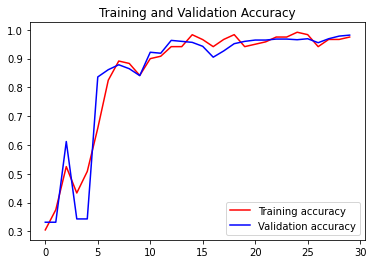
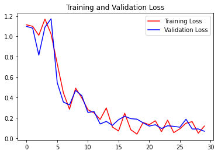
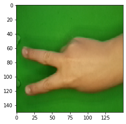

# IMAGE RECOGNITION USING SEQUENTIAL MODELS

## DATASET
### Link Dataset

Rock-Paper-Scissors Images Dataset from Kaggle

Link Dataset [Rock-Paper-Scissors](https://www.kaggle.com/drgfreeman/rockpaperscissors/download)
### Description
This dataset contains images of hand gestures from the Rock-Paper-Scissors game. The images were captured as part of a hobby project where I developped a Rock-Paper-Scissors game using computer vision and machine learning on the Raspberry Pi (https://github.com/DrGFreeman/rps-cv).

### Metadata
    Usage Information             License                     CC BY-SA 4.0 (https://creativecommons.org/licenses/by-sa/4.0/)
                                  Visibility                  visibility Public
    
    Provenance                    Sources                     (https://github.com/DrGFreeman/rps-cv)

    Maintainers                   Dataset owner               drgfreeman (https://www.kaggle.com/drgfreeman)

    Authors                       Name                        Julien de la Bruère-Terreault
    
    Updates                       Expected update frequency   Never
                                  Last updated                2019-03-01                 
                                  Date created                2019-01-19                  
                                  Current version             Version 2

## OBJECTIVES
### Problem Framing
	How to predict images from Rock-Scissors-Paper Images Dataset?
### Ideal Outcome
	* A success metric is that images can predict what images that is Rock or Scissors or Paper picture.
	* Success means the numbers of predicting upper 90% accuracy from that images. 
	* Failure means the result of predicting no better than heuristics.
### Heuritic
	* Consider collected images from the dataset that categories Rock or Scissors or Paper pictures in the past. Assume that images will labialize that image or not. 
### Formulation
	The dataset modeling steps are:
	- The dataset is divide into train sets and validation sets. 
	- Implement image augmentation. 
	- Use images data generator. 
	- The model pursues to use a sequential model. 
	- Model training does not exceed 30 minutes.
	- The accuracy of the model is at least 90%. 
	- Can predict the images uploaded to Colab. 

## RESULTS

 					 

- The Accuracy and Validation accuracy reaches 99% and 98%. That means the models have success metrics.
- The graph titled "Validation Training and Accuracy" that could see, the distance of training data and validation is close so that overfitting does not occur.

**Image Prediction Output**

